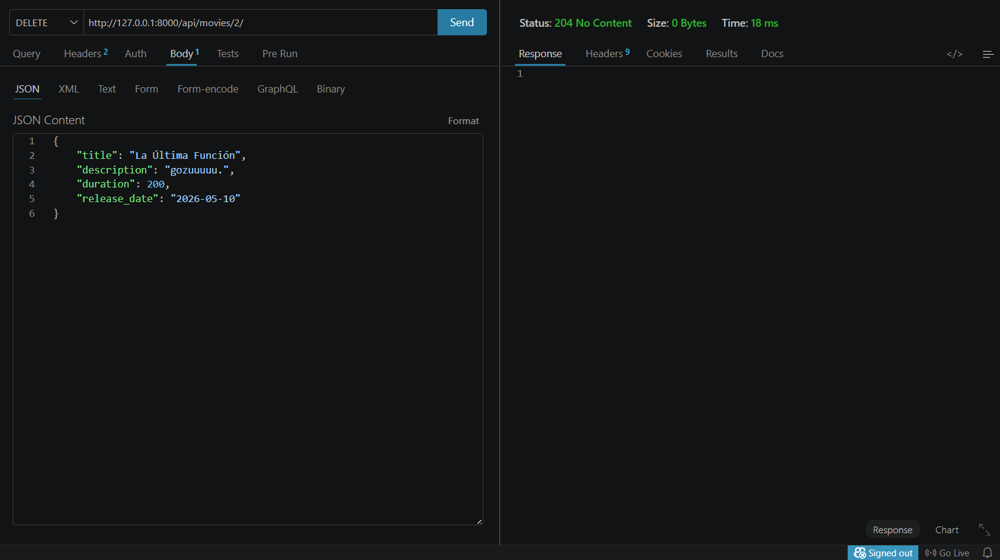
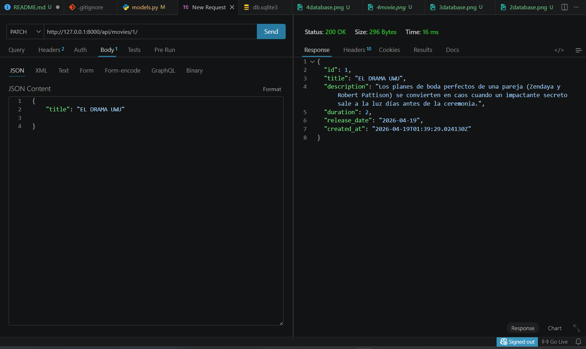
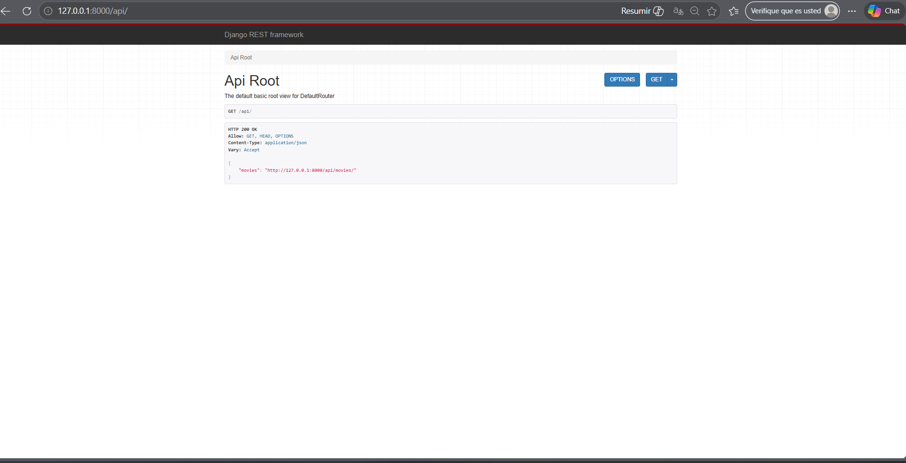
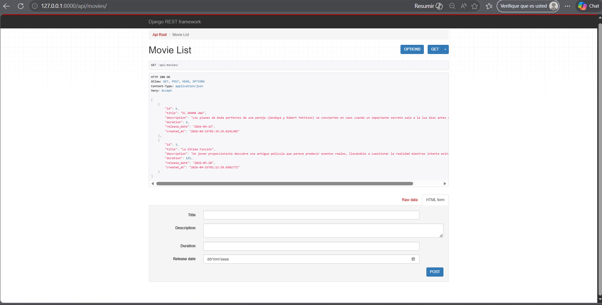

# Favio Solorzano Cardenas 
# Daniella Leon 

Database 

### GET http://127.0.0.1:8000/api/movies/

### POST http://127.0.0.1:8000/api/movies/

### PUT http://127.0.0.1:8000/api/movies/2/

### DELETE http://127.0.0.1:8000/api/movies/2/

### PATCH http://127.0.0.1:8000/api/movies/1/

### Interface http://127.0.0.1:8000/api

### Interface http://127.0.0.1:8000/api/movies/

# Daniella Leon Andres - Capturas

## API - Consumo

## Listado de Películas

## Listado de Movies (GET)

  <b> Base de Datos Get</b>  
  

## Registrar Movie (POST)

  <b>Base de Datos post</b>  
  

## Reemplazar Movie (PUT)

  <b> Base de Datos put</b>  
  

## Actualizar parcialmente Movie (PATCH)

  <b> Base de Datos patch</b>  
  

## Borrar Movie (DELETE)

  <b> Base de Datos Delete</b>  
  

